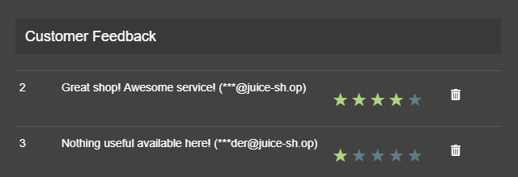
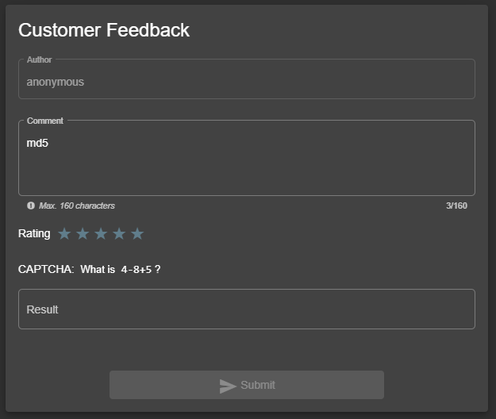

# Level 2

## Admin Section (Broken Access Control)
_Access the administration section of the store._

At first, you need to log in with `admin` role. See one of:
- [Level 2 / Login Admin](#login-admin-injection)
- [Level 3 / Admin Registration](level3.md#admin-registration-improper-input-validation)

Then, go to `/main-es2015.js` and search for `admin`. One of the results is:
```
,{path:"administration",component:Xi,canActivate:[_]},
```

Navigate to `/#/administration`

## Deprecated Interface (Security Misconfiguration)
_Use a deprecated B2B interface that was not properly shut down._

Searching for `B2B` in `/main-es2015.js` points to this text:
```
Input area for uploading a single invoice PDF or XML B2B order file or a ZIP archive containing multiple invoices or orders
```

The surrounding code tells us this is the _Complaint_ (`/#/complain`) form.

Log in and upload any XML document into the Complaint form, for example:
```xml
<?xml version="1.0" encoding="UTF-8"?>
<hello>world</hello>
```

The response is:
```
410 Error: B2B customer complaints via file upload have been deprecated for security reasons: <?xml version="1.0" encoding="UTF-8"?><hello>world</hello> (hello.xml)
```

## Five-Star Feedback (Broken Access Control)
_Get rid of all 5-star customer feedback._

Start with [Admin Section](#admin-section-broken-access-control) and then simply delete the 5-star feedback.



## Login Admin (Injection)
_Log in with the administrator's user account._

According to the challenge category, we need to use (SQL) injection.

Go to the _Login_ form (`/#/login`)


```
E-mail: ' or 1=1;
Password: aaaaaaaaa
```

Luckily, admin is the first user in the database.

## Login MC SafeSearch (Sensitive Data Exposure)
_Log in with MC SafeSearch's original user credentials without applying SQL Injection or any other bypass._

I used the same approach as in [Password Strength](#password-strength-broken-authentication) challenge.

You can find the user's email in Administration, it's `mc.safesearch@juice-sh.op`.

MD5 password hash is `b03f4b0ba8b458fa0acdc02cdb953bc8` and can be easily reverted into `Mr. N00dles`.

## Meta Geo Stalking (Sensitive Data Exposure)
_Determine the answer to John's security question by looking at an upload of him to the Photo Wall and use it to reset his password via the Forgot Password mechanism._

Name of the challenge hints us to search in metadata. I used http://metapicz.com/.

If you upload the image, you will get the GPS coordinates:
```
GPSLatitudeRef   North
GPSLatitude      36.958717
GPSLongitudeRef  West
GPSLongitude     84.348217
```

Next, I used https://www.gps-coordinates.net/ to find the place. After a few failed attempts trying variations of
`Scuttlehole trail`, I zoomed out and got the correct answer: `Daniel Boone National Forest`.  

## Password Strength (Broken Authentication)
_Log in with the administrator's user credentials without previously changing them or applying SQL Injection._

At first, log in as admin (see [Login Admin](#login-admin-injection) challenge).

Grab the JWT token from cookies:
```
eyJ0eXAiOiJKV1QiLCJhbGciOiJSUzI1NiJ9.eyJzdGF0dXMiOiJzdWNjZXNzIiwiZGF0YSI6eyJpZCI6MSwidXNlcm5hbWUiOiIiLCJlbWFpbCI6ImFkbWluQGp1aWNlLXNoLm9wIiwicGFzc3dvcmQiOiIwMTkyMDIzYTdiYmQ3MzI1MDUxNmYwNjlkZjE4YjUwMCIsInJvbGUiOiJhZG1pbiIsImRlbHV4ZVRva2VuIjoiIiwibGFzdExvZ2luSXAiOiIwLjAuMC4wIiwicHJvZmlsZUltYWdlIjoiYXNzZXRzL3B1YmxpYy9pbWFnZXMvdXBsb2Fkcy9kZWZhdWx0LnN2ZyIsInRvdHBTZWNyZXQiOiIiLCJpc0FjdGl2ZSI6dHJ1ZSwiY3JlYXRlZEF0IjoiMjAyMC0wOC0xNCAwOTozNjoyOC4wNzQgKzAwOjAwIiwidXBkYXRlZEF0IjoiMjAyMC0wOC0xNCAwOTozNjoyOC4wNzQgKzAwOjAwIiwiZGVsZXRlZEF0IjpudWxsfSwiaWF0IjoxNTk3Mzk4NTA5LCJleHAiOjE1OTc0MTY1MDl9.uRUsiD4NRpn8TXX7JUvwb1TbhAvVZZVA3sZWV8qJiHzWNtnqzQB5T7mz-GASQrsp6WNdvpVjtHwabbj9ZfSzCmgmMxs_JRaY4RyjHrSs6GWmwU1dNmhiL8I-TVmIF5_4Ujd9BxoxX_MAvVs7-Gme932CcTPwZ4sbEmWiv_-nbRA
```

Decode it (https://jwt.io/):
```
{
  "status": "success",
  "data": {
    "id": 1,
    "username": "",
    "email": "admin@juice-sh.op",
    "password": "0192023a7bbd73250516f069df18b500",
    "role": "admin",
    "deluxeToken": "",
    "lastLoginIp": "0.0.0.0",
    "profileImage": "assets/public/images/uploads/default.svg",
    "totpSecret": "",
    "isActive": true,
    "createdAt": "2020-08-14 09:36:28.074 +00:00",
    "updatedAt": "2020-08-14 09:36:28.074 +00:00",
    "deletedAt": null
  },
  "iat": 1597398509,
  "exp": 1597416509
}
```

The password hash is `0192023a7bbd73250516f069df18b500`.
Based on the hash length (128 bits), this is most likely `MD5`.
Assuming the password is weak, it can be easily reverted.
Go to https://hashtoolkit.com/decrypt-md5-hash/0192023a7bbd73250516f069df18b500.
The password is `admin123`.

Log out and log in again with `admin@juice-sh.op` / `admin123`

## Reflected XSS (XSS)
_Perform a reflected XSS attack with <iframe src="javascript:alert(`xss`)">._

You need to find a place where (usually) a query param is reflected back on the user screen.

For example
```
/#/track-result/new?id=<iframe%20src%3D"javascript:alert(%60xss%60)">
```

## Security Policy (Miscellaneous)
_Behave like any "white-hat" should before getting into the action._

Similar to `robots.txt` file, there's also a "well-known" `security.txt` file.
It's located at `.well-known/security.txt`.

For more details see https://securitytxt.org/.

## View Basket (Broken Access Control)
_View another user's shopping basket._

Log in and click on _Your Basket_. Observe that HTTP request `GET /rest/basket/1` is sent.
Modify the request URL to `/rest/basket/2`.

You can use the same techniques as in [Zero Stars](level1.md#zero-stars-improper-input-validation) challenge.

## Visual Geo Stalking (Sensitive Data Exposure)
_Determine the answer to Emma's security question by looking at an upload of her to the Photo Wall and use it to reset her password via the Forgot Password mechanism._

It's all about looking carefully at the picture:

 

Name of the company is `ITsec`.

## Weird Crypto (Cryptographic Issues)
_Inform the shop about an algorithm or library it should definitely not use the way it does._

The troublesome algorithm is [MD5](https://en.wikipedia.org/wiki/MD5). Never ever use it for hashing
passwords. It can be easily reverted (see [Password Strength](#password-strength-broken-authentication) challenge).

Navigate to _Customer Feedback_ in the top left menu.



Type `md5` in the _Comment_ field and submit.