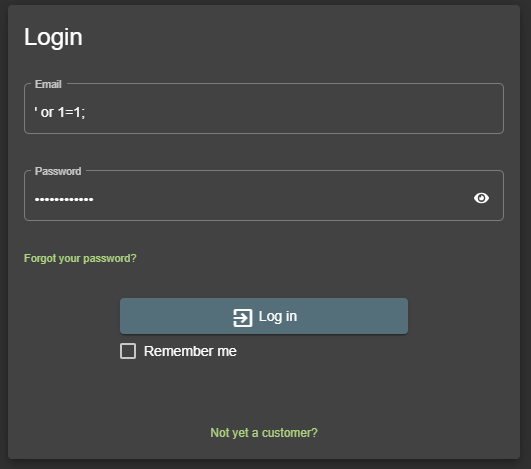

# Level 2

## Admin Section
_Access the administration section of the store._

At first, you need to log in with `admin` role. See one of:
- [Level 2 / Login Admin](#login-admin)
- [Level 3 / Admin Registration](level3.md#admin-registration)

Then, go to `/main-es2015.js` and search for `admin`. One of the results is:
```
,{path:"administration",component:Xi,canActivate:[_]},
```

Navigate to `/#/administration`

## Login Admin
_Log in with the administrator's user account._

According to the challenge category, we need to use (SQL) injection.

Go to the _Login_ form (`/#/login`)



```
E-mail: ' or 1=1;
Password: aaaaaaaaa
```

Luckily, admin is the first user in the database.